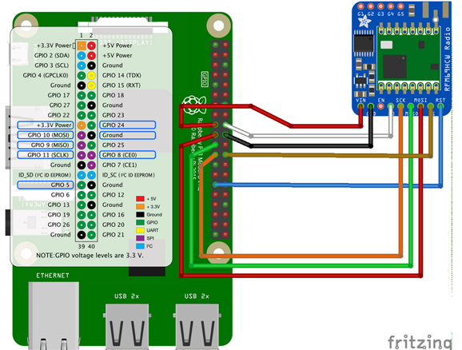

<!--
*** Thanks for checking out this README Template. If you have a suggestion that would
*** make this better, please fork the repo and create a pull request or simply open
*** an issue with the tag "enhancement".
*** Thanks again! Now go create something AMAZING! :D
***
***
***
*** To avoid retyping too much info. Do a search and replace for the following:
*** github_username, repo_name, twitter_handle, email
-->


<!-- PROJECT SHIELDS -->
<!--
*** I'm using markdown "reference style" links for readability.
*** Reference links are enclosed in brackets [ ] instead of parentheses ( ).
*** See the bottom of this document for the declaration of the reference variables
*** for contributors-url, forks-url, etc. This is an optional, concise syntax you may use.
*** https://www.markdownguide.org/basic-syntax/#reference-style-links
-->
[![Contributors][contributors-shield]][contributors-url]
[![Forks][forks-shield]][forks-url]
[![Stargazers][stars-shield]][stars-url]
[![Issues][issues-shield]][issues-url]
[![MIT License][license-shield]][license-url]
[![LinkedIn][linkedin-shield]][linkedin-url]


<!-- PROJECT LOGO -->
<br />
<p align="center">
 

  <h3 align="center">arduino-raspi-lora</h3>

  <p align="center">
    building a long range system to analyze measurement without internet connection.
with LoRa connection we can transfer data from all the feather's sensors to the raspberry-pi.
the raspberry pi build as a thread per task server.
    <br />
    <a href="https://github.com/CiTRuS93/arduino-raspi-lora"><strong>Explore the docs »</strong></a>
    <br />
    <br />
    <a href="https://github.com/CiTRuS93/arduino-raspi-lora">View Demo</a>
    ·
    <a href="https://github.com/CiTRuS93/arduino-raspi-lora/issues">Report Bug</a>
    ·
    <a href="https://github.com/CiTRuS93/arduino-raspi-lora/issues">Request Feature</a>
  </p>
</p>


<!-- TABLE OF CONTENTS -->
## Table of Contents

* [About the Project](#about-the-project)
  * [Built With](#built-with)
* [Getting Started](#getting-started)
  * [Connections](#connections)
  * [Prerequisites](#prerequisites)
    * [Raspberry pi](#raspberry-pi)
    * [Feather](#feather)
  * [Installation](#installation)
     * [Raspberry pi](#raspberry-pi)
     * [Feather](#feather)
* [Contact](#contact)


<!-- ABOUT THE PROJECT -->
## About The Project

<!--[![Product Name Screen Shot][product-screenshot]](https://example.com)-->


### Components

* [Raspberry-pi](https://www.raspberrypi.org/)
* [Adafruit RFM69HCW Transceiver Radio Breakout](https://www.adafruit.com/product/3071)
* [Adafruit RFM69HCW Transceiver Radio Bonnet - 868 or 915 MHz - RadioFruit](https://www.adafruit.com/product/4072)


<!-- GETTING STARTED -->
## Getting Started

To get a local copy up and running follow these simple steps.

### Connections


### Prerequisites

#### Raspberry pi
* enable SPI using `sudo raspi-config`>Interfacing Options>SPI
#### Feather
* arduino IDE


### Installation
#### Raspberry pi
1. Clone the repo
```sh
git clone https://github.com/CiTRuS93/arduino-raspi-lora.git

```
2. 
```sh
cd raspberry-pi
  pip install -r requirements.txt
```
#### feather

* install LowPowerLab RFM69 from arduino IDE
* mount feather_lora.ino


<!-- CONTACT -->
## Contact


Project Link: [https://github.com/CiTRuS93/arduino-raspi-lora](https://github.com/CiTRuS93/arduino-raspi-lora)


<!-- MARKDOWN LINKS & IMAGES -->
<!-- https://www.markdownguide.org/basic-syntax/#reference-style-links -->
[contributors-shield]: https://img.shields.io/github/contributors/CiTRuS93/arduino-raspi-lora.svg?style=flat-square
[contributors-url]: https://github.com/CiTRuS93/arduino-raspi-lora/graphs/contributors
[forks-shield]: https://img.shields.io/github/forks/CiTRuS93/arduino-raspi-lora.svg?style=flat-square
[forks-url]: https://github.com/CiTRuS93/arduino-raspi-lora/network/members
[stars-shield]: https://img.shields.io/github/stars/CiTRuS93/arduino-raspi-lora.svg?style=flat-square
[stars-url]: https://github.com/CiTRuS93/arduino-raspi-lora/stargazers
[issues-shield]: https://img.shields.io/github/issues/CiTRuS93/arduino-raspi-lora.svg?style=flat-square
[issues-url]: https://github.com/CiTRuS93/arduino-raspi-lora/issues
[license-shield]: https://img.shields.io/github/license/CiTRuS93/arduino-raspi-lora.svg?style=flat-square
[license-url]: https://github.com/CiTRuS93/arduino-raspi-lora/blob/master/LICENSE.txt
[linkedin-shield]: https://img.shields.io/badge/-LinkedIn-black.svg?style=flat-square&logo=linkedin&colorB=555
[linkedin-url]: https://www.linkedin.com/in/hadar-cohen-79b92a107/
[product-screenshot]: images/screenshot.png


